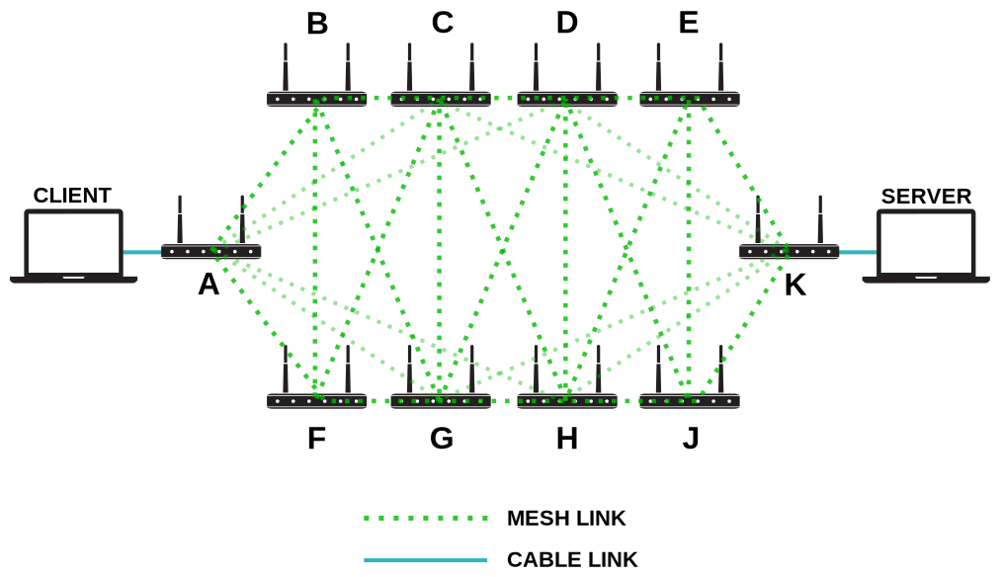
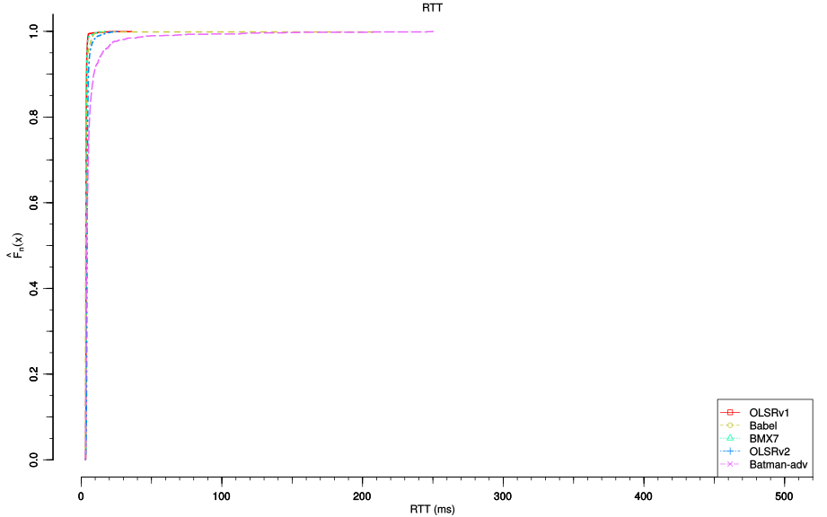
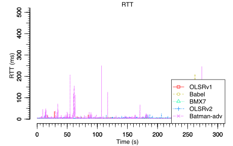
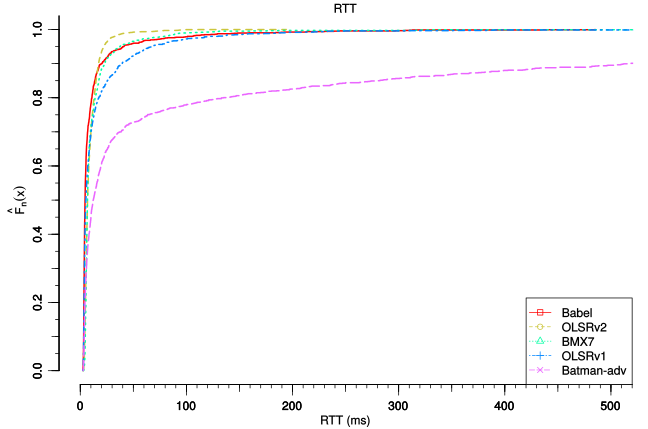
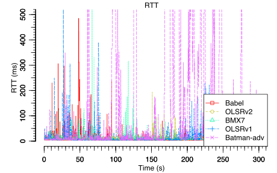
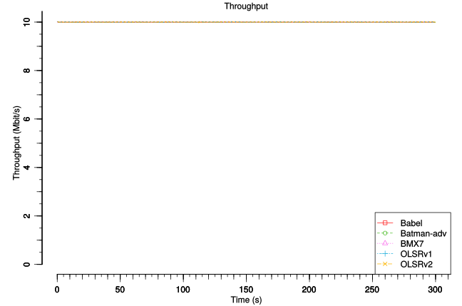

1. The Mesh of Death Adversity
==============================

Topology and scenario
---------------------

*(Amadeus Alfa, Juliusz Chroboczek, Federico Capoano, Goran Mahovlić, Tomislava,
Dario Stelitano, Riccardo Bloise)*

Our test network consists of 10 wifi routers all directly connected to each
others with one exception: *A* and *K* are not directly connected.  Each router
operates simultaneously with two different frequencies, one in 2.4 GHz, and the
other in 5 Ghz.  To avoid a link between *A* and *K*, we put them in different
rooms and diminished their transmission power, while other routers (*B* to *J*)
were in a large hall.

In order to test the performances of this network, two hosts are connected with
wires at the extremities of the network: the client to *A*, and the server to
*K*.  We use wires to avoid interfering with the network we were testing.  Then,
the client performs some tests, using two tools: ``ping``, to measure the
latency between the two hosts, and ``iperf``, to stress out the network and
measure the throughput.

In this scenario, we are comparing 5 actively maintained and deployed routing
protocols: Babel, Batman-adv, BMX7, OLSRv1 and OLSRv2.

.. note::
   * Some links are not drawn to avoid unnecessary confusion,
   * Remark that the shortest path from *A* to *K* consists of 2 hops,
   * There is no router *I* to avoid a possible confusion with the number 1.

Problems
--------

This topology looks like really simple, but we expect that the interferences
generated by as many routers should be sufficient to make differences between
protocols.

Indeed, as described in `The Hidden Node Problem
<https://en.wikipedia.org/wiki/Hidden_node_problem>`__, a wifi adapter is either
transmitting or receiving.  From a routing point of view, this means that doing
two hops on the same channel will divide the throughput by two, and with three
hops by three, etc.  Using multiple non-interfering channels can avoid this
problem, or at least will limit it: the transit node of a two hop route with
each hop on a different channel can receive on one channel packets that it
simultaneously send on the other channel.  Another problem with wifi is that the
performances decrease quickly with the distance because of packet loss: it is
often better to take a two hop route instead of a long one hop route, even if
the two hops are on the same channel.

From a routing point of view, we see that there is a real challenge: choosing
the right tradeoff between taking a few hops, dodging lossy links and varying
the channels used.

Requirements
------------

- 10x Tp Link WDR4300 with OpenWRT
- 2x laptops with real ethernet ports (no adapters)
- 2x ethernet cables

Configuration
-------------

.. note::
    All the configuration files for each router are
    `available on github
    <https://github.com/battlemesh/battlemesh-test-docs/tree/master/v8/testbed/config>`__.

    The `binary of the firmware <http://battlemesh.org/BattleMeshV8/Firmware>`__
    is also available.

Each node is a dual radio wireless router (TP-Link WDR4300), the most important facts
related to the configuration are:

* multi channel mesh (2 GHz and 5 GHz)
* dual stack (IPv4 and IPv6)
* protocols installed: **Babel**, **Batman-adv**, **BMX7**, **OLSRv1** and **OLSRv2**
* laptops were connected to the mesh with static routes on nodes *A* and *K*

.. warning::
   By the end of the eight edition we came to the conclusion that having to set up static
   routes to plug laptops into the mesh was a mistake.

   We also haven't been able to run batman-adv with the same network configuration
   of the other routing protocols.

   For these reasons Henning Rogge proposed `a better configuration plan for the next
   edition (Battlemesh v9)
   <http://ml.ninux.org/pipermail/battlemesh/2015-August/003839.html>`__.

Test
----

*(Henning Rogge, Thijs Van Veen)*

.. note::
    The test script is `available on github
    <https://github.com/battlemesh/battlemesh-test-docs/blob/master/v8/testbed/scripts/run_test_1-4.sh#L46-L90>`__,
    the relevant sections are test 1, 2 and 3.It has been carefully crafted such
    that the tests can be repeated easily.

The tests mainly consisted in generating traffic from the client connected to
*A* to the server connected to *K*. The measurements were collected on the
client.

3 different tests were performed:

* **reboot**: measure ping RTT while the mesh is rebooted
* **ping**: only measure ping RTT
* **ping + iperf**: measure ping RTT and throughput of a 10 Mbit/s UDP Iperf stream running simultaneously

.. note::
   **RTT** stands for `Round Trip Time <https://en.wikipedia.org/wiki/Round-trip_delay_time>`__

Results
-------

*(Matthieu Boutier)*

Graphs and raw data are provided for each test.

.. note::
   * The graphs were generated with the following command (requires the
     `R programming language <https://www.r-project.org/>`__)::

         R --vanilla --slave --args --out-type svg --separate-output --maxtime 300 --maxrtt 500 --width 9 --height 5.96 --palette "#FF0000 #005500 #0000FF #000000" results/ < generic.R

     the script `generic.R
     <https://github.com/battlemesh/battlemesh-test-docs/tree/master/v8/data/generic.R>`__ is available on github.

   * **ECDF** stands for `Empirical Cumulative Distribution Function
       <https://en.wikipedia.org/wiki/Empirical_distribution_function>`__.  If
       you are not habituated to read this kind of graphs, have a look to our
       :doc:`quick "how to" <ecdf>`.

reboot
^^^^^^

In the reboot experience, we let the network run stable for some time, and then
suddently reboot all routers simultaneously.  The following graph show a quick
overview of the whole experience.

.. image:: ./images/1-reboot-rtt-normal.svg
   :target: ./images/1-reboot-rtt-normal.svg

What interests us in this experience is the small part after the reboot: the
following graph represent the ECDF graph of the ping samples taken for 50s after
the reboot.  The x-axis is scaled to show only packets than less than 50ms: we
see that all protocols are choosing fast routes, since in all cases, the RTT of
the packets are below 50ms.  In this particular example though, Babel, BMX7 and
OLSRv1, with almost all packets being under 10ms, outperforms Batman-adv and
OLSRv2, which "only" have 80% of the packets under 10ms.

.. image:: ./images/1-reboot-rtt-ecdf-zoom.svg
   :target: ./images/1-reboot-rtt-ecdf-zoom.svg

R --vanilla --slave --args --out-type svg --separate-output --mintime 140 --maxtime 200 --maxrtt 50 --width 6.4 --height 4 --palette "#FF0000 #005500 #0000FF #000000" --summary-palette "#ff1a1a #4ebe2a #f96eec #26b1dd #fcb500" --summary-only results/001-20150808/1 < generic.R

Zooming at the normal graphs around time 150 gives us other precious
informations: we see when the routing protocols begins to forward packets, which
should reflect the convergence time of each protocol.  Regarding this benchmark,
we observe the following convergence time:

===== ====== ==== ====== ======
Babel OLSRv2 BMX7 OLSRv1 Batman
151   155    159  163    182
+0    +4s    +8s  +12s   +23s
===== ====== ==== ====== ======

.. image:: ./images/1-reboot-rtt-normal-zoom.svg
   :target: ./images/1-reboot-rtt-normal-zoom.svg

R --vanilla --slave --args --out-type svg --separate-output --mintime 140 --maxtime 200 --maxrtt 20 --width 6.4 --height 4 --palette "#FF0000 #005500 #0000FF #000000" --summary-palette "#ff1a1a #4ebe2a #f96eec #26b1dd #fcb500" --summary-only results/001-20150808/1 < generic.R

.. note::
   `Raw data for this test
   <https://github.com/battlemesh/battlemesh-test-docs/tree/master/v8/data/results/001-20150808/1>`__
   is available on github.

ping
^^^^

Measured RTT in ECDF graph:

Measured RTT in classic graph:

.. note::
   `Raw data for this test
   <https://github.com/battlemesh/battlemesh-test-docs/tree/master/v8/data/results/001-20150808/2>`__
   is available on github.

ping + iperf
^^^^^^^^^^^^

Measured RTT in ECDF graph:

Measured RTT in classic graph:

Measured Bitrate:

.. note::
   `Raw data for this test
   <https://github.com/battlemesh/battlemesh-test-docs/tree/master/v8/data/results/001-20150808/3>`__
   is available on github.

Article written by Federico Capoano, Matthieu Boutier, Thijs van Veen.
