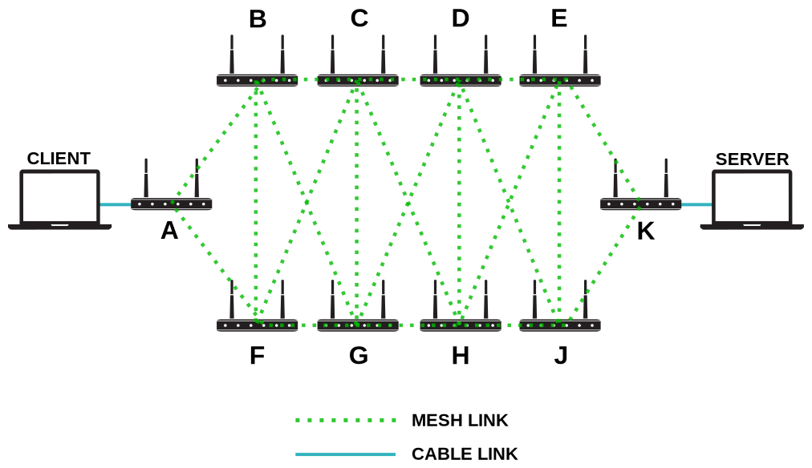

Scenario 3: The Mesh of Death Adversity
=======================================

Scenario
--------

This scenario contains two aspects which come into play when wifi nodes are placed in close proximity.

First of all, as described in :doc:`The Hidden Node Problem <1-the-hidden-node-problem>`, a Wi-Fi adapter is either transmitting or receiving.
To properly function, this requires some form of medium access control, which defines who can transmit and when.
Having a lot of different transmitters nearby should cause more difficult medium access control.

Secondly, the routing protocols require information about the network topology to calculate the best path to send packets.
In order to obtain this information protocols may send special packets to probe which node is connected to whom and how well.
When the MAC protocol gets strained from the data being sent by all nodes, timeouts might be caused for such probes.

Topology
--------

We have two topologies, we'll run tests on both in two modes:

a. **Single channel**
b. **Multi channel**

First topology: (almost) full mesh
^^^^^^^^^^^^^^^^^^^^^^^^^^^^^^^^^^

In the first topology the network will consist of six nodes which are almost fully connected.

What will be tested is the the routing from **A** to **D**.

In this topology there are different ways the protocols can route the packets, yet it's compact enough to properly notice the wi-fi interference.

Second topology: diamond shaped mesh
^^^^^^^^^^^^^^^^^^^^^^^^^^^^^^^^^^^^

.. image:: ./images/3-mesh-of-death-adversity-diamond.svg

The second topology is a variant of the first one, we don't have an almost fully connected mesh, but a diamond shaped one.

We'll test again the routing from **A** to **D**.

Problems
--------

First of all, the interference from the different Wi-Fi radios should make transmissions a bit more troublesome, causing issues even without any routing protocol.
Adding the strain from all the topology probes, can break badly configured protocols.

Test plan
---------

One by one turn on the wireless routers and measure the overall traffic being generated by
the respective routing protocol (**OLSR(2)**, **Babel**, **BMX6** and **Batman-adv**) within 10 **(TODO: refine)**
minutes depending on the amount of active nodes (use default settings).

When done, describe what you did to improve the situation (e.g. adjustment of txpower).

**Requirements:**

- 6x TL-WDR4300 with OpenWRT

Results and interpretation
--------------------------

... TODO ...
