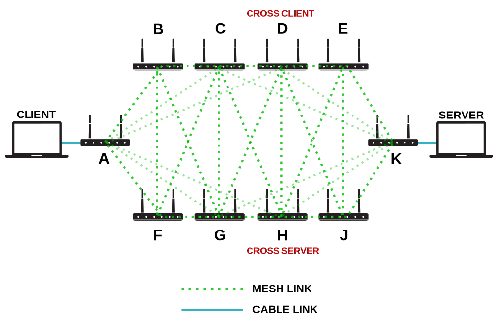
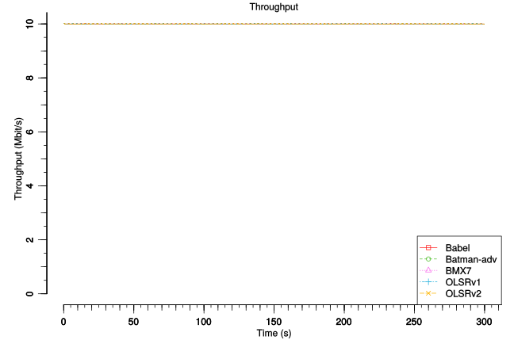

2. The Crossed Streams Jeopardy
===============================

.. warning::
    To perform the crossed streams tests we had to reuse the
    topology prepared for :doc:`The Mesh of Death Adversity Test
    <1-the-mesh-of-death-adversity>` because we were running out of time.

    Therefore this scenario inherits all the settings of the previous test
    but adds an additional stream of traffic to stress test the network.

Topology
--------

Same as :doc:`The Mesh of Death Adversity Test <1-the-mesh-of-death-adversity>`
with a small variation:

* there is a second stream of iperf traffic from node ``D`` to ``H``

Test
----

.. note::
    The test scripts are available on github:

    * `10mbit iperf streams <https://github.com/battlemesh/battlemesh-test-docs/blob/master/v8/testbed/scripts/run_test_1-4.sh#L92-L106>`__
    * `100mbit iperf streams <https://github.com/battlemesh/battlemesh-test-docs/blob/master/v8/testbed/scripts/run_test_4-5.sh#L43-L57>`__

The tests mainly consisted in measuring ping *Round Trip Time* and throughput
from **client** to **server** while generating two streams of traffic:

1. from the **client** connected to **A** to the **server** connected **K**
2. from node **D** (*cross client*) to node **H** (*cross server*)

The measurements where collected from **A**.

2 different tests were performed:

* **10mbit iperf streams**: measure ping RTT while 2 simultaneous 10 Mbit/s UDP
  Iperf streams cross the network
* **100mbit iperf streams**: measure ping RTT while 2 simultaneous 100 Mbit/s
  UDP Iperf streams cross the network

.. note::
   * **RTT** stands for `Round Trip Time <https://en.wikipedia.org/wiki/Round-trip_delay_time>`__
   * **ECDF** stands for :doc:`Empirical Cumulative Distribution Function <ecdf>`

Results
-------

Graphs and raw data are provided for each test.

.. note::
   The graphs were generated with the following command (requires the
   `R programming language <https://www.r-project.org/>`__)::

       R --vanilla --slave --args --out-type svg --separate-output --maxtime 300 --maxrtt 500 --width 9 --height 5.96 --palette "#FF0000 #005500 #0000FF #000000" results/ < generic.R

   the script `generic.R
   <https://github.com/battlemesh/battlemesh-test-docs/tree/master/v8/data/generic.R>`__
   is available on github.

10mbit iperf streams
^^^^^^^^^^^^^^^^^^^^

Measured RTT in :doc:`ECDF <ecdf>` graph:

(**How to read:** closer to left is better, learn more about :doc:`how to read ECDF graphs <ecdf>`)

.. image:: ./data/results/001-20150808/4/rtt-ecdf-summary.svg
   :target: ../_images/rtt-ecdf-summary3.svg

Measured RTT in classic graph:

(**How to read:** lower is better)

.. image:: ./data/results/001-20150808/4/rtt-normal-summary.svg
   :target: ../_images/rtt-normal-summary3.svg

Measured Bitrate (from **client** to **server**):

(**How to read:** higher is better)

.. note::
   `Raw data for this test
   <https://github.com/battlemesh/battlemesh-test-docs/tree/master/v8/data/results/001-20150808/4>`__
   is available on github.

100mbit iperf streams
^^^^^^^^^^^^^^^^^^^^^

Measured RTT in :doc:`ECDF <ecdf>` graph:

(**How to read:** closer to left is better, learn more about :doc:`how to read ECDF graphs <ecdf>`)

.. image:: ./data/results/002-20150808/4/rtt-ecdf-summary.svg
   :target: ../_images/rtt-ecdf-summary4.svg

Measured RTT in classic graph:

(**How to read:** lower is better)

.. image:: ./data/results/002-20150808/4/rtt-normal-summary.svg
   :target: ../_images/rtt-normal-summary4.svg

Measured Bitrate (from **client** to **server**):

(**How to read:** higher is better)

.. image:: ./data/results/002-20150808/4/bitrate-normal-summary.svg
   :target: ../_images/bitrate-normal-summary2.svg

.. note::
   `Raw data for this test
   <https://github.com/battlemesh/battlemesh-test-docs/tree/master/v8/data/results/002-20150808/4>`__
   is available on github.

Article written by Federico Capoano, Matthieu Boutier.
