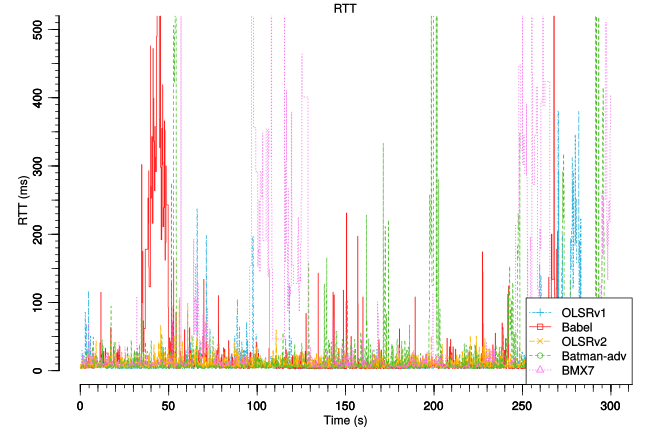
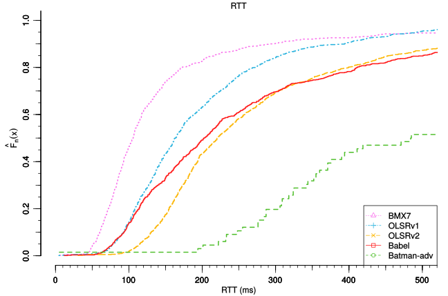

2. The Crossed Streams Jeopardy
===============================

Here we will put tests 4 and 4 with 100 mbit.

Test
----

.. note::
    The test scripts are available on github:

    * `10mbit iperf streams <https://github.com/battlemesh/battlemesh-test-docs/blob/master/v8/testbed/scripts/run_test_1-4.sh#L92-L106>`__,
    * `100mbit iperf streams <https://github.com/battlemesh/battlemesh-test-docs/blob/master/v8/testbed/scripts/run_test_4-5.sh#L43-L57>`__,

The tests mainly consist in measuring ping *Round Trip Time* from **client** to **server** while generating two streams of traffic:

1. from the **client** connected to **A** to the **server** connected **K**
2. from node **D** to node **H**

The measurements where collected from **A**.

2 different tests were performed:

* **10mbit iperf streams**: measure ping RTT while 2 simultaneous 10 Mbit/s UDP Iperf streams cross the network
* **100mbit iperf streams**: measure ping RTT while 2 simultaneous 100 Mbit/s UDP Iperf streams cross the network

.. note::
   * **RTT** stands for `Round Trip Time <https://en.wikipedia.org/wiki/Round-trip_delay_time>`__.
   * **ECDF** stands for `Empirical Cumulative Distribution Function <https://en.wikipedia.org/wiki/Empirical_distribution_function>`__.

Results
-------

Graphs and raw data are provided for each test.

.. note::
   The graphs were generated with the following command (requires the R programming language)::

       R --vanilla --slave --args --separate-output --maxtime 300 --maxrtt 500 --width 12.8 --height 8 --palette "#FF0000 #005500 #0000FF #000000" --out-type svg results/ < generic.R

   the script `generic.R
   <https://github.com/battlemesh/battlemesh-test-docs/tree/master/v8/data/generic.R>`__ is available on github.

10mbit iperf streams
^^^^^^^^^^^^^^^^^^^^

Measured RTT in ECDF graph:

.. image:: ./data/results/001-20150808/4/rtt-ecdf-summary.svg
   :target: ../_images/rtt-ecdf-summary3.svg

Measured RTT in classic graph:

Measured Bitrate in ECDF graph:

.. image:: ./data/results/001-20150808/4/bitrate-ecdf-summary.svg
   :target: ../_images/bitrate-ecdf-summary1.svg

Measured Bitrate in classic graph:

.. image:: ./data/results/001-20150808/4/bitrate-normal-summary.svg
   :target: ../_images/bitrate-normal-summary1.svg

.. note::
   `Raw data for this test
   <https://github.com/battlemesh/battlemesh-test-docs/tree/master/v8/data/results/001-20150808/4>`__
   is available on github.

100mbit iperf streams
^^^^^^^^^^^^^^^^^^^^

Measured RTT in ECDF graph:

Measured RTT in classic graph:

Measured Bitrate in ECDF graph:

.. image:: ./data/results/002-20150808/4/bitrate-ecdf-summary.svg
   :target: ../_images/bitrate-ecdf-summary2.svg

Measured Bitrate in classic graph:

.. image:: ./data/results/002-20150808/4/bitrate-normal-summary.svg
   :target: ../_images/bitrate-normal-summary2.svg

.. note::
   `Raw data for this test
   <https://github.com/battlemesh/battlemesh-test-docs/tree/master/v8/data/results/002-20150808/4>`__
   is available on github.

