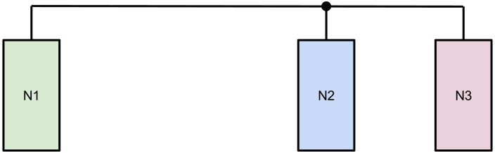

Scenario 2: The PowerLAN Conundrum
==================================

Setup and description
---------------------

*Scenario*

PowerLAN (or Powerline communication) is a networking technology that emulates an ethernet connection over existing electrical wiring.
Using this technology, nodes can be connected through power outlets rather than routers.
Running the network over existing power lines reduces the need for extra ethernet cabling and wifi noise.

*Topology*

Seeing as power lines are generally interconnected, the resulting network(segment) can be seen as a simple bus topology.
A typical PowerLAN setup with 3 adapters looks like this:

*Problems*

While mostly similar to an ethernet network, PowerLAN knows a few unique difficulties.
First and foremost powerlines and their routing are designed to supply electricity to a building, rather than carry high-speed communication data.
Besides the effects from old/low-quality wiring, every time an electrical device is turned on or off, it will negatively impact data transmissions.
Surge protectors and breakers can even completely block off communication.

At the moment, PowerLAN technology is mostly working peer-to-peer based.
Since many end-users can benefit from PowerLAN when connecting their homes it would be good to know how well these networks work as part of a dynamic mesh network.

Test plan
---------

You will set up a basic PowerLAN network as above, running **OLSR(2)**, **BMX6** and
**B.A.T.M.A.N.** to proof all protocols support PowerLAN connectivity (don’t do
simultaneously). After that generate some traffic load between N2 and N3 (e.g. using
iperf) and see how route selection changes in all the different protocols.

When done, create an AdHoc wireless network on N2 and N3 and analyze which path will be
preferred by the respective routing protocol.

**Requirements:**

- 3x TL-WDR4300 with OpenWRT (including iperf, olsr, olsr2, bmx6 and batman-adv)
- 3x TL-PA4010P Powerline adapter

Results and interpretation
--------------------------

... TODO ...
