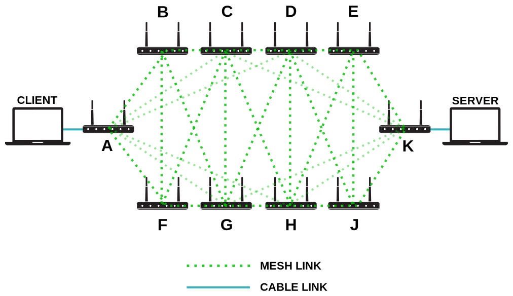
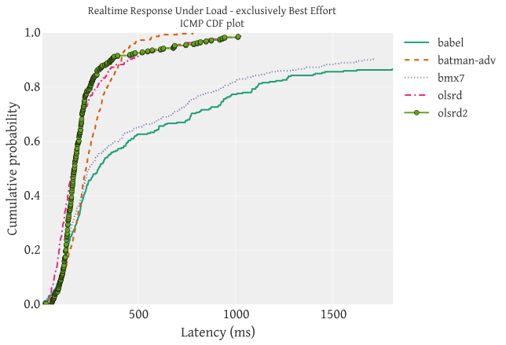
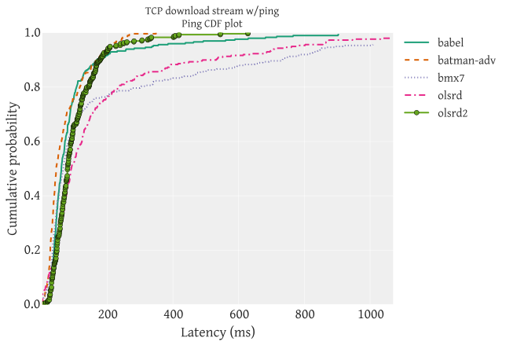
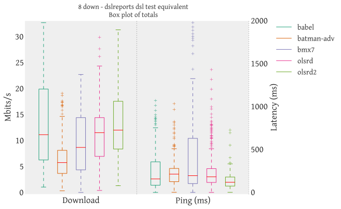

3: Blowing up the network
=========================

.. warning::
    To perform this test we had to reuse the
    topology prepared for :doc:`The Mesh of Death Adversity Test
    <1-the-mesh-of-death-adversity>` because we were running out of time.

    Therefore this scenario inherits all the settings of the previous test
    but adds parallel streams of traffic between **A** and **K** in order to
    deliberately cause disruption in the network.

Test
----

.. note::
    The tests were performed with `Flent (FLExible Network Tester)
    <https://flent.org/>`__, the `shell script that launches the 5 different tests
    <https://github.com/battlemesh/battlemesh-test-docs/blob/master/v8/testbed/scripts/flent-tests.sh>`__
    is available on github.

The tests mainly consisted in generating a high amount of traffic between
**client** and **server** while measuring network performance.

We ran five different tests on the test setup:

* Realtime Response Under Load (RRUL) test
* Realtime Response Under Load Best Effort (RRUL_BE) test
* TCP download test
* TCP upload test
* 8-streams download test, designed to mimic the `dslreports speedtest <http://www.dslreports.com/speedtest>`__

The point of this test series is to see what happens when the network is loaded
to capacity (and beyond). Hence the "Blowing up the network" title of this test
series. Since we only did a single test run, drawing conclusions from
comparisons is not possible; but the tests can give an indication of the kind of
behaviour that occurs at high load and point out areas for further
investigation. And more rigorous testing with, above all, more repetitions can
be performed to actually draw conclusions.

Realtime Response Under Load (RRUL) tests
^^^^^^^^^^^^^^^^^^^^^^^^^^^^^^^^^^^^^^^^^

The **RRUL** test consists of running four simultaneous bulk TCP streams in
both the upstream and downstream directions (so eight streams total),
while simultaneously running UDP and ICMP latency measurements. The test
runs for 60 seconds, to make sure the network is fully saturated.

Two variants of the test were performed:

* the straight **RRUL** test, which marks each of the four TCP streams with different
  diffserv markings matching the mapping into hardware queues in the WiFi stack
* best-effort only (called **RRUL_BE**) in which no diffserv marking is employed

A timeseries graph of the behaviour of the RRUL test looks like this:

The TCP streams start up five seconds after the ping measurements start, which
is the flat part of the bottom-most graph. Then, after the TCP flows start, the
latency goes up significantly, peaking at several seconds of latency and quite a
bit of packet loss (seen as gaps in the graph). The throughput figures are
likewise erratic and throughput is highly asymmetric. Finally, the UDP latency
measurement flows are lost entirely; this happens because Netperf stops the
measurement flows when encountering packet loss.

The name of the data set the above graph came from is deliberately omitted. The
point here is not to beat up on a particular protocol, but to show the general
pattern of failure experienced. As noted above, one should be wary comparing the
different protocols from this data set, since there was only one test run.
Instead, consider this an indication that they all break down, and that further
investigation (and fixes!) is needed.

Aggregate results from all five protocols is available below, along with a link
to the dataset which can be explored in further detail with the Flent tool,
which can also run the tests for those wishing to explore the behaviour of their
own network.

TCP traffic tests
^^^^^^^^^^^^^^^^^

The TCP traffic tests are just a single TCP stream with
simultaneous latency measurement.

Two different tests were performed:

* TCP download
* TCP upload

8-streams download test
^^^^^^^^^^^^^^^^^^^^^^^

The **8-stream** download test runs eight simultaneous download streams while also
measuring latency.

This test is designed to mimic the `dslreports speedtest <http://www.dslreports.com/speedtest>`__.

Results
-------

Graphs are provided for each test.

`Raw data <https://github.com/battlemesh/battlemesh-test-docs/tree/master/v8/data/results/002-20150808/5>`__
is available on github.

.. note::
   The graphs were generated with `Flent (FLExible Network Tester) <https://flent.org/>`__
   from the `raw data <https://github.com/battlemesh/battlemesh-test-docs/tree/master/v8/data/results/002-20150808/5>`__
   collected in flent data files.

Realtime Response Under Load (RRUL)
^^^^^^^^^^^^^^^^^^^^^^^^^^^^^^^^^^^

ICMP latency in :doc:`ECDF <ecdf>` graph:

(**How to read:** closer to left is better, learn more about :doc:`how to read ECDF graphs <ecdf>`)

Download bandwidth, upload bandwidth and ICMP latency in box graph:

Realtime Response Under Load Best Effort (RRUL_BE)
^^^^^^^^^^^^^^^^^^^^^^^^^^^^^^^^^^^^^^^^^^^^^^^^^^

ICMP latency in :doc:`ECDF <ecdf>` graph:

(**How to read:** closer to left is better, learn more about :doc:`how to read ECDF graphs <ecdf>`)

Download bandwidth, upload bandwidth and ICMP latency in box graph:

TCP download
^^^^^^^^^^^^

Ping latency in :doc:`ECDF <ecdf>` graph:

(**How to read:** closer to left is better, learn more about :doc:`how to read ECDF graphs <ecdf>`)

Download bandwidth and ping latency in box graph:

TCP upload
^^^^^^^^^^

Ping latency in :doc:`ECDF <ecdf>` graph:

(**How to read:** closer to left is better, learn more about :doc:`how to read ECDF graphs <ecdf>`)

Upload bandwidth and ping latency in box graph:

8-streams download test
^^^^^^^^^^^^^^^^^^^^^^^

Ping latency in :doc:`ECDF <ecdf>` graph:

(**How to read:** closer to left is better, learn more about :doc:`how to read ECDF graphs <ecdf>`)

8 downloads bandwidth and ping latency in box graph:

Article written by Toke Høiland-Jørgensen, Federico Capoano.
