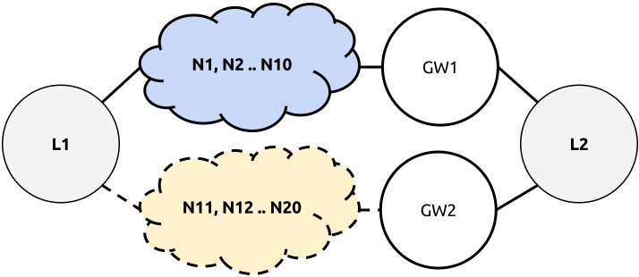

Scenario 4: The Convergence Time Relay
======================================

Setup and description
---------------------

You create a large mesh cloud of 20 routers spread all over the place like this:

The metric of L1 → GW1 needs to be a lot better than the metric of L1 → GW2 (see dotted
line in figure above), while GW1 and GW2 are both gateways announcing the address of L2.
When creating this setup make sure the upper path will be preferred under normal conditions.

Test plan
---------

You will analyze how long it takes one routing protocol to decide using path L1 → GW2
after upper L1 → GW1 has been switched off and vice versa. Use mtr to perform a continuous
traceroute between L1 and L2, use ping with short interval option to count lost replies.

**Requirements:**

- 20x TL-WDR4300 with OpenWRT (including olsr, olsr2, bmx6 and batman-adv)

Results and interpretation
--------------------------

... TODO ...
