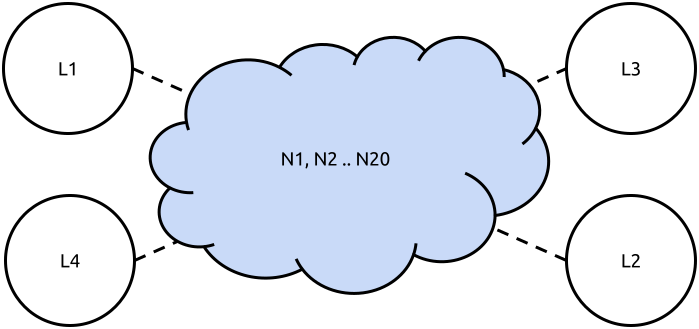

Scenario 5: The Crossed Streams Jeopardy
========================================

Setup and description
---------------------

You create a large mesh cloud of 20 routers spread all over the place like this:

You can use your laptops or any other wired device (L1 .. L4) to connect to the wireless
edge routers.

Test plan
---------

You will analyze if one routing protocol can choose the best paths for two streams in
order to gain maximum throughput during a 20 minute TCP stream session. Start both streams
at the same time from L1 → L2 and L3 → L4 respectively. Measure the total number of bytes
transferred when both streams have finished transmitting.

**Requirements:**

* 20x TL-WDR4300 with OpenWRT (including olsr, olsr2, bmx6 and batman-adv)

Results and interpretation
--------------------------

... TODO ...
