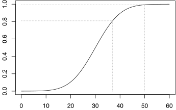
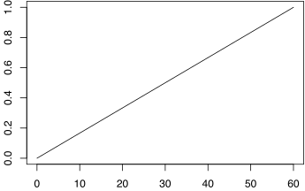
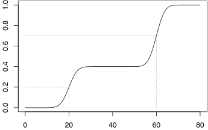
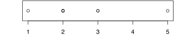
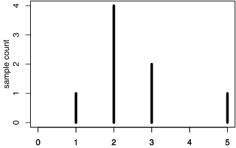
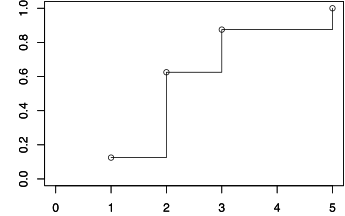
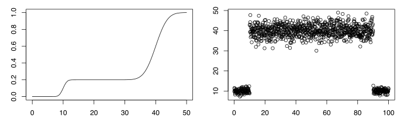

=====================
Reading (E)CDF graphs
=====================

An ECDF graph is very usefull to have a summary analysis of a big sample of very
different values, but the first contact is quite surprising.  Indeed, there is
only one data represented on an ECDF graph, for example the RTT, while we are
habituated to have one data in function of another, for example the RTT in
function of the time of the experiment.

This document will explain you how to quickly interpret an ECDF graph: first
with a simple example, then with a more general approach, and finally by showing
you how to generate such graphs.

Quick example: reading a RTT CDF graph
======================================

In networking, the RTT (Round Trip Time) is the time taken by a packet to go
from one computer to another, and to come back.  It is common to measure it with
the ``ping`` command.  A CDF graph of the RTT of an experiment as the following
will give you informations about the global performances of the network, as:

 - almost all packets have more than 10ms and less than 50ms RTT,

 - 80% of the packets are faster than 37ms,

but also about its fairness: here, we see that most of the packets are between
10 and 50ms.  A perfectly fair network would looks like a vertical line (all
packets have the same RTT).

Going deeper
============

A CDF (Cumulative **Distribution** Function) graph shows the **distribution** of
the samples among values.  Looking at CDFs can give you a quick view of
pathologies, or specificities.  The first example below shows you a segment
going from one corner to the other one, on a wide range of values: the values
are uniformally distributed.  This is probably what you expect if, for example,
you consider the timestamps of the collected samples.  Having such result in an
RTT graph would be more surprising.

The second example is more interesting: here there is two bearings at different
values.  The data are distributed in two sets around values 20 and 60.  The
y-axis gives you the amount of samples which have these values: here, we see
that it's around 40% and 50% for the data having respectively 20 and 60 as
values.  Applied to RTT, it means that some packets travel faster than others,
with a clear separation: there should be a good reason, but of course, the graph
will not tell you which!

Understanding and drawing ECDF
==============================

As stated bedore, an ECDF represents the distribution of the samples among their
values: the order in which data are provided doesn't matter, but only the values
of the data.  Let's consider the following sample collection, with heigh values.

=============  =  =  =  =  =  =  =  =
Sample number  1  2  3  4  5  6  7  8
Sample value   3  2  2  3  1  2  5  2
=============  =  =  =  =  =  =  =  =

A simple distribution representation would fit in one dimension, with plots, or
vertical bars, dispached on an axis representing the values of the samples.

=====================  =  =  =  =  =  =  =  =
Sample value (sorted)  1  2  2  2  2  3  3  5
=====================  =  =  =  =  =  =  =  =

Of course, this kind of representation didn't hide the fact that some samples
have the same value.  The natural idea here would be to use some histogram-like
representation, with vertical bars which the number of the samples in y-axis.

=====================================  =  =  =  =
Sample value (sorted and aggregated)   1  2  3  5
Count                                  1  4  2  1
=====================================  =  =  =  =

This will work for this example, but becomes quickly useless when we have many
values, near but slighly different.  To solve this issue, the ECDF is just the
same, with cumulated number of samples and step plotting.  The cumulated number
of samples is then rebased on 1, which gives the probablility of the
distribution (which is think by common mortals as percentage).

=====================================  ===  ===  ===  ===
Sample value (sorted and aggregated)   1    2    3    5
Count (cumulated)                      1    5    7    8
Count (cumulated and rebased)          1/8  5/8  7/8  8/8
=====================================  ===  ===  ===  ===

Another and equivalent way to compute ECDF is to directly associate the
cummulated numbers to the original (sorted) samples.  Indeed, we remark that
each sample contribute to 1/(number of samples) in the y-axis.

========================  ===  ===  ===  ===  ===  ===  ===  ===
Sample value (sorted)     1    2    2    2    2    3    3    5
Cumulated sample number   1/8  2/8  3/8  4/8  5/8  6/8  7/8  8/8
========================  ===  ===  ===  ===  ===  ===  ===  ===

Important remark
================

When you are performing an experiment, there may be trailing data which are not
really part of the experiment.  In a classic graph, it doesn't really matter,
because we naturally see that when the curve is going to be flat and without any
interest, then the experiment should be on its end, and we naturally don't pay
much attention to such singularities.  However, in ECDF graph, results are
aggregated, and there is no way to know from where comes the packets.  It is
therefore important to take care of removing trailing data before processing an
ECDF.  The following graph illustrate this issue: we see that the first bearing
should not be represented in the ECDF graph.

Article written by Matthieu Boutier.
